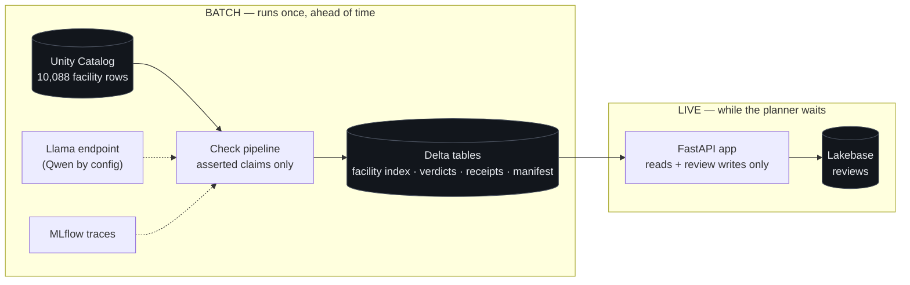

# Facility Trust Desk

**Does a facility's record support what it claims?**

Built for Hack-Nation Challenge 04, *Data Legend* — Databricks x Virtue Foundation.

> [Architecture, explained visually](https://claude.ai/code/artifact/f024a24c-c01c-4567-8c26-ad8f7f1e1159) ·
> [Live UI concept](https://claude.ai/code/artifact/6c0e58d1-a3ac-45fe-b854-75f9d5481e9f) ·
> [Full architecture doc](docs/architecture.md)

---

## The challenge

The dataset holds 10,088 Indian medical facility records. Each one lists what it can do:
"we have an ICU." Nobody has ever checked whether those claims are true.

A family drives six hours to reach a hospital and finds the ICU was a claim, not a capability.
The brief's framing: NGO and public-health planners "do not lack data. They lack evidence they
can act on." The reasoning layer already exists; the challenge is the **product layer** — a live
Databricks App that turns messy records into decisions a non-technical planner can trust,
defend, and save.

The brief offers four mission tracks and asks for exactly one, nailed end to end.

## Our track: Facility Trust Desk

Its minimum workflow, quoted from the brief:

> Planner selects a capability (ICU, maternity, emergency, oncology, trauma, NICU) and region ->
> sees ranked facilities with trust signals -> expands any facility to inspect citations ->
> overrides the assessment with a note.

Why this track: the unit of work is one facility's claims, and the job is verifying each against
evidence while being honest about uncertainty. That is where the rubric's largest bucket — 35%
for Evidence and Trust — lives.

## The thesis

**We are not shipping the right answer. We are shipping the thing that lets people add better
answers.**

There is no answer key for 10,000 hospitals, so every checking method is one opinion — including
ours. The brief says outright that it values apps which double-check their own work. So the
checks are built to be **swappable and measurable**: each one is an independent unit that can be
added, removed, or replaced with one file and one config line, every verdict records which check
decided it, and reviewer feedback accumulates per check so a swap can be evaluated instead of
asserted. A doctor who knows more about ICUs than we do should improve the system by writing a
file, not by reading our code.

## How a record is judged

Each record has four fields we can read: its description, its capability list, its equipment
list, and its procedure list. Claims descend a pipeline of configured checks, cheapest first —
presence, vocabulary, then a batched open-weight model for entailment. A check that cannot
safely decide **abstains** and passes the item along; a check that breaks records a processing
failure, never a silent "no evidence."

Each field ends up with one of five grades:

| Grade | Meaning |
|---|---|
| Backs it | This field says something that supports the claim |
| Says nothing | The field has content, but never mentions this capability |
| Blank | The field is empty. Absence of proof, not proof of absence |
| Contradicts | The field says the opposite of the claim |
| Unreadable | We could not process it. Our failure, recorded, never hidden |

**"Says nothing" and "blank" are never merged.** That distinction is the data-desert versus
medical-desert split — the difference between "there is no hospital here" and "we have no
information about here" — pushed down to the field level.

The four grades combine into one verdict — strong record support, limited record support,
conflicting evidence, not enough evidence, or could not check — by a fixed rule we wrote.
Never a model. The same four grades always produce the same answer, so a label can never drift
from the evidence beneath it. The rule is shown in the UI, because the rule *is* the trust
story.

## Architecture

The full design, its contract, and every tradeoff live in [docs/architecture.md](docs/architecture.md),
with a [visual walkthrough](https://claude.ai/code/artifact/f024a24c-c01c-4567-8c26-ad8f7f1e1159).
The shipped pipeline is:

**ingest and quarantine -> configured checks -> deterministic reduction and verdict -> atomic
Delta publication -> read-only app.**



Nothing is adjudicated while someone waits. Free Edition gives one 2X-Small warehouse, so every
claim is settled in batch, published atomically (a partial run can never become active), and the
app only reads verdicts and writes reviews.

## The UI

The [concept mock](https://claude.ai/code/artifact/6c0e58d1-a3ac-45fe-b854-75f9d5481e9f) is the
planner's whole journey: pick a capability and region, see facilities ranked by how well their
own record backs the claim, expand any row to read the receipt — the per-field grades, the exact
cited sentences, and which check made each call — then confirm or override with a note.

Two ideas in it are load-bearing:

1. **A per-field evidence grade**, shown for all four fields, so the verdict is inspectable
   rather than a black-box score.
2. **Low-data facilities are structurally separated, not sorted to the bottom.** They sit below
   a divider reading: not ranked low — unassessed. A blank record is a gap in the paperwork, not
   a verdict on the hospital.

## Honesty rules the system enforces

1. A parsing failure is quarantined as "could not check." It never degrades into "not enough
   evidence," which would blame the facility for our bug.
2. Extractor boilerplate ("No specific procedures listed in the provided content") reads as no
   data, never as a contradiction.
3. A negative only counts against a claim when it binds to that claim. "12-bed intensive care
   unit. Dental services not available." does not refute the ICU claim.
4. Nothing is silently dropped: quarantined rows publish their failure reason as a receipt.
5. No invented confidence score. There is no calibration set yet, so we do not print a number
   that implies there is.
6. Reviewer decisions are stored as snapshotted feedback per check — never described as measured
   accuracy, because a reviewer reads the same row we do.

## Repository layout

```
src/trustdesk/   marks.py (grades and the verdict rule) · lexicon.py (vocabularies) · ladder.py (checks)
tests/           the behavioural pin for the refactor to configured checks
app/             the concept mock and the FastAPI shell that will serve it
docs/            architecture (start here) · requirements · dataset-audit · demo plan · learnings
scripts/         Databricks MCP launcher · platform verification spike
NOTES.md         running decisions and findings, in the order they happened
```

## Running the tests

```sh
uv run pytest -q
```

29 tests pass. They pin the current behaviour through the planned refactor from hardcoded checks
to configured units.

## Who built this

Stephen Pasco ([timezyme](https://github.com/timezyme)) — built solo during the hackathon, with
the working notes, decisions, and dead ends kept in the open in `NOTES.md` and `docs/`. The
project's one rule applies to its own history too: show the receipts.
