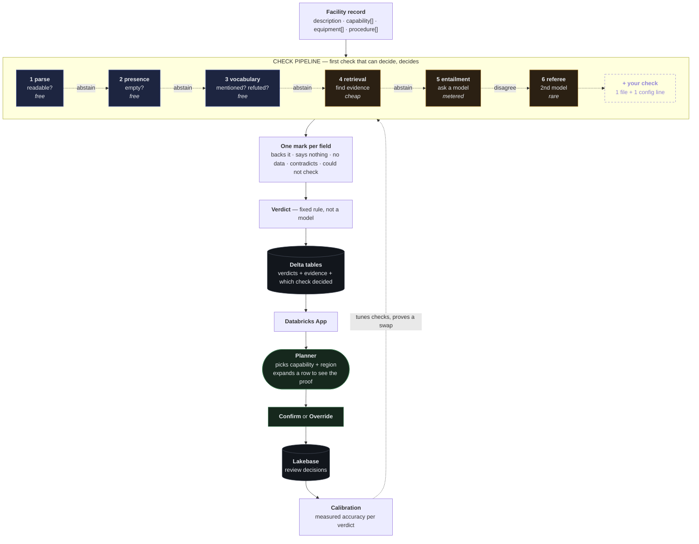
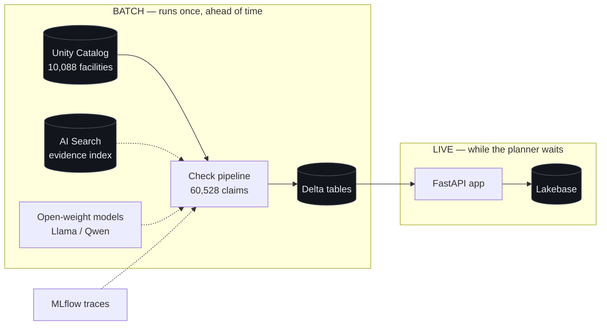

# Architecture

## Context for anyone reading this cold

**The challenge.** Hack-Nation Challenge 04, *Data Legend* (Databricks x Virtue Foundation). We are
given 10,000 Indian medical facility records. Each record lists what the facility can do — "we have
an ICU." Nobody has ever checked whether those claims are true. Families travel hours to a hospital
and find the ICU was a claim, not a capability. The brief's framing: planners do not lack data, they
lack evidence they can act on.

**Our task.** We chose one of four offered tracks: **Facility Trust Desk**. Its required workflow,
quoted from the brief:

> Planner selects a capability (ICU, maternity, emergency, oncology, trauma, NICU) and region ->
> sees ranked facilities with trust signals -> expands any facility to inspect citations ->
> overrides the assessment with a note.

**What we are scored on.** Evidence and Trust 35%, Product Judgment 30%, Technical Execution 25%,
Ambition 10%. The brief says outright: "Since there is no ground truth, we value apps that
double-check their own work." That sentence is why this architecture is shaped the way it is.

**The thesis.** We are not shipping the right answer. We are shipping the thing that lets people add
better answers. Every checking method is one opinion, including ours, so the checks are built to be
swapped and measured — and every verdict records which check decided it.

---

## The system

Left to right in the pipeline is cheapest to most expensive. A check that cannot settle a case
**abstains** and passes it along. The dashed box is the point: adding a check is one file and one
config line.

## Where each piece runs

Nothing is adjudicated while someone waits. Free Edition gives one 2X-Small warehouse, so all claims
are settled in batch and the app only reads.

---

## Components and what each one owns

| Component | Owns | Does not own |
|---|---|---|
| **Ingest** | Parsing a raw row, validating it, quarantining what is malformed | Any judgement about the facility |
| **Claim source** | Deciding which capabilities a record asserts | Whether those claims are true |
| **Evidence source** | Turning fields into readable units. One array item, or a description | What those units mean |
| **Check** | Judging one claim against one unit, or abstaining | Ordering, cost policy, other checks |
| **Pipeline** | Running checks in order, taking the first decision, recording which | What any check concludes |
| **Budget policy** | Whether an escalation is affordable right now | What a check does when allowed |
| **Field reducer** | Collapsing several findings for one field into one mark | The final verdict |
| **Verdict rule** | Collapsing four marks into one verdict | Any evidence handling |
| **Sink** | Writing verdicts and evidence to Delta | Reading them back |
| **App** | Reading precomputed verdicts, presenting evidence, capturing review | Adjudicating anything |
| **Calibration** | Turning review decisions into measured accuracy | Changing verdicts |

The rule that keeps these honest: **data crosses component boundaries as value objects, never as raw
rows.** A component that receives a raw row is doing someone else's job.

## The seams, and why each exists

1. **Check boundary.** A check sees one claim and one piece of evidence, and may abstain. Checks
   never call each other and never know what else is in the pipeline. This exists so a check can be
   added, removed, reordered, or replaced without touching any other.

2. **Decider versus enricher.** Most checks answer. Some only add material — retrieval fetches
   supporting and refuting passages so the entailment check has something to read. Separating them
   means retrieval can be swapped for a different search without the entailment check noticing.

3. **Cost tier.** Every check declares what it costs: free, cheap, metered, rare. The pipeline uses
   this to order and to budget. This exists because Free Edition rate limits are undocumented, so
   how aggressively we escalate must change without editing checks.

4. **Evidence source registration.** Fields become evidence through a registry. The dataset carries
   `numberDoctors` and `capacity` that we currently ignore; adding one is a registration, not a
   rewrite, because it arrives in the same shape everything already handles.

5. **Verdict rule as a strategy.** The rule that turns marks into a verdict is one replaceable unit,
   separate from everything that produced the marks.

## Decisions and their tradeoffs

**Cheapest check first, first decision wins.**
*Why:* 60,528 claims cannot each afford a model call on Free Edition.
*The catch:* cheap-first becomes sloppy-first unless constrained, so a check may decide **only when
no more expensive check could overturn it**. Otherwise it abstains.
*Evidence this is right:* both reachable models were tested on three cases and both scored 2 of 3,
failing the same one — they call "contradicts" on records that simply never mention the capability.
The free vocabulary check owns that case with certainty and never escalates it. Cheaper *and* more
accurate.

**Abstention is a first-class result, not a failure.**
*Why:* a check that guesses when unsure produces confident wrong answers, which is the worst outcome
for a trust product.
*Cost:* an unresolved claim is a real state the UI has to show, rather than something we can hide.

**Precompute everything, serve nothing live.**
*Why:* one 2X-Small warehouse, and a demo that must not stall.
*Cost:* verdicts are stale between runs, and re-running is a batch job rather than a click.

**The verdict is derived, never model-written.**
*Why:* a label that a model writes can drift from the evidence beneath it.
*Cost:* the rule is blunt, and cannot express "almost."

**No numeric confidence score.**
*Why:* we have no calibration set, so a number would imply precision we do not have.
*Cost:* less legible at a glance than "0.87". We accept that until measured accuracy exists.

**Review decisions are labels, not just storage.**
*Why:* it is the only way to prove a swapped check is an improvement rather than a change.
*Cost:* needs volume before it says anything, so early numbers must be shown as uncertain.

**Capabilities and pipelines are data, not code.**
*Why:* a doctor who knows more about ICUs than we do should improve the system by writing a file.
*Cost:* indirection, and a config format to maintain.

## Known cost of this design

Indirection, in a hackathon. It earns its place only because the checks genuinely churn — the
vocabulary check was already rewritten once after the dataset audit, and checks 4 through 6 do not
exist yet. If the check set were settled, this would be over-engineering.

## Constraints that forced these choices

- Must ship as a live Databricks App on **Free Edition**, demoed live.
- One SQL warehouse, fixed at 2X-Small.
- Frontier models are rate-limited to zero in this workspace. Only open-weight models are reachable,
  so model calls are scarce and must be earned.
- Three claim fields are JSON arrays of extracted sentences, not prose. Items are judged one at a
  time.
- Descriptions are thin — median 115 characters, many just "Hospital" or "Open 24 Hrs".
- Most negative language in the corpus is extractor boilerplate, so a bare negative regex is not a
  contradiction detector.
- Source URLs are row-level, not sentence-level. Citations must be honest about that.

See `docs/dataset-audit.md` for the measurements behind the last four.

## Open question this design must survive

We do not know what fraction of claims the free checks settle. If nearly everything escalates, the
economics fail. A 300-claim labelled pilot is measuring it — and because every verdict records which
check decided, the answer is observable per check rather than only in aggregate.

**Where to push back.** The riskiest bets are that cheap checks settle most cases, that real
contradictions are common enough to deserve first-class support, and that this indirection pays for
itself in the time available. Critique those first.

## Current state versus this design

`src/trustdesk/ladder.py` has the right behaviour in the wrong shape — the checks are hardcoded as
if/else inside one function rather than separate units. The 43 existing tests pin the behaviour and
must keep passing through the refactor. Implementation detail lives in the code, not here.
