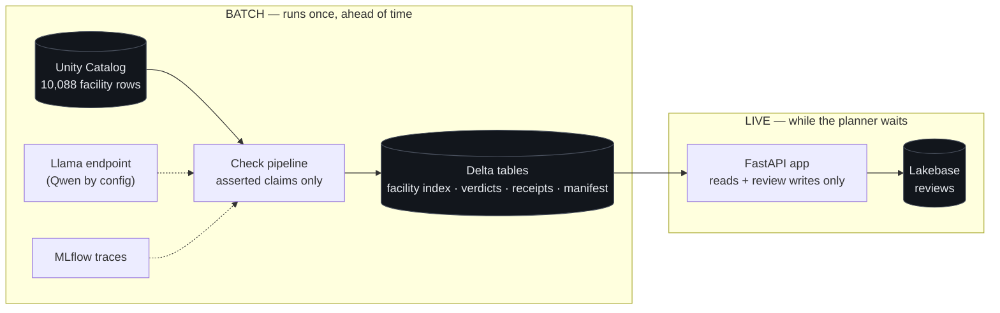

# Architecture

## Context for anyone reading this cold

**The challenge.** Hack-Nation Challenge 04, *Data Legend* (Databricks x Virtue Foundation). The live
table has 10,088 Indian medical facility rows; 9,947 have a non-empty capability field. Those fields
state what a facility says it can do — "we have an ICU." Nobody has ever checked whether those claims
are true. Families travel hours to a hospital and find the ICU was a claim, not a capability. The
brief's framing: planners do not lack data, they lack evidence they can act on.

**Our task.** We chose one of four offered tracks: **Facility Trust Desk**. Its required workflow,
quoted from the brief:

> Planner selects a capability (ICU, maternity, emergency, oncology, trauma, NICU) and region ->
> sees ranked facilities with trust signals -> expands any facility to inspect citations ->
> overrides the assessment with a note.

**What we are scored on.** Evidence and Trust 35%, Product Judgment 30%, Technical Execution 25%,
Ambition 10%. The brief says outright: "Since there is no ground truth, we value apps that
double-check their own work." That sentence is why this architecture is shaped the way it is.

**The thesis.** We are not shipping the right answer. We are shipping the thing that lets people add
better answers. Every checking method is one opinion, including ours, so the checks are built to be
swapped and measured — and every verdict records which check decided it.

This document is the single source of truth for the shipped contract. `docs/winning-demo-plan.md`
owns the execution order and timeboxes. `docs/strategy.md` and `docs/verdict-contract.md` are
superseded and kept for history.

---

## The system

The shipped pipeline is: **ingest and quarantine -> configured checks -> deterministic reduction
and verdict -> atomic Delta publication -> read-only app.**

```mermaid
%%{init: {"flowchart": {"wrappingWidth": 560}}}%%
flowchart TB
    REC["<b>1 · A hospital's row</b><br/>Read one row from the table.<br/>—————————<br/><b>The 4 fields we read</b><br/>description — a sentence about the place<br/>capability — list of what it says it does<br/>equipment — list of machines it says it has<br/>procedure — list of operations it says it performs<br/>—————————<br/><b>Example</b><br/>description → “District hospital. Open 24 hrs.”<br/>capability → [“ICU”, “maternity”, “surgery”]"]
    REC --> ING["<b>2 · Ingest and quarantine</b><br/>Parse and validate the row before anything judges it.<br/>—————————<br/><b>What can happen to a row</b><br/>valid — becomes clean value objects with a stable record key<br/>duplicate id — distinct rows keep distinct deterministic keys<br/>byte-identical duplicate — may collapse after Phase 3A proves it<br/>quarantined — malformed; recorded as a processing failure<br/>—————————<br/><b>Example</b><br/>3 visibly corrupted rows → quarantined, never silently dropped"]
    ING --> CLAIM["<b>3 · Pick the claims to check</b><br/>Pair the record with each target capability it asserts.<br/>—————————<br/><b>The rule</b><br/>asserted — its capability list names one of the 6 targets → a claim<br/>not asserted — no claim; shown as “does not claim this”<br/>—————————<br/><b>Example</b><br/>capability → [“ICU”, “maternity”, “surgery”]<br/>targets hit → ICU, maternity<br/>claims → “has an ICU?” · “offers maternity care?”"]
    NOTE["<b>Note · why only 6 capabilities?</b><br/>—————————<br/><b>The planner's dropdown has 6</b><br/>ICU · maternity · emergency<br/>oncology · trauma · NICU<br/>—————————<br/><b>Hospitals list about 19 each</b><br/>We ignore the rest.<br/>Nobody can search for them.<br/>—————————<br/><b>The list is not proof</b><br/>It is what the hospital says about itself.<br/>We only have the row to check the row."]
    CLAIM -.- NOTE
    CLAIM --> PIPE

    subgraph PIPE["<b>4 · Try to answer it</b> — configured checks in a row, cheapest first. The first one that CAN answer, does."]
      direction LR
      P1["<b>1 presence</b><br/>Is the field blank?<br/><br/><i>free · gate</i>"]
      P2["<b>2 vocabulary</b><br/>Does the text say ICU?<br/>Does it say no ICU?<br/><i>free · swappable</i>"]
      P3["<b>3 entailment</b><br/>Ask Llama, in batch:<br/>does this text prove it?<br/><i>metered · swappable</i>"]
      PX["<b>+ your check</b><br/>Drop yours in anywhere.<br/>1 file + 1 config line"]
      P1 -.->|"can't tell"| P2 -.->|"can't tell"| P3 -.-> PX
    end

    OUTC["<b>Note · every check answers one of 3 ways</b><br/>—————————<br/>decision — it settles the item, and says why<br/>abstention — it cannot tell; the next check tries<br/>processing failure — it broke; recorded, never hidden<br/>—————————<br/><b>Example</b><br/>vocabulary reads “no ICU on site”<br/>→ decision: contradicts"]
    PIPE -.- OUTC

    PIPE --> REDUCE["<b>5 · Boil each field down to one grade</b><br/>A field can hold many items; each item gets judged on its own.<br/>—————————<br/><b>Today's rule</b><br/>contradicts beats everything<br/>backs it beats says nothing<br/>a failed item makes the field unreadable, never invisible<br/>—————————<br/><i>swappable — this is one opinion.</i><br/><i>“any doubt wins” is another.</i>"]
    REDUCE --> MARK["<b>6 · The grade for each of the 4 fields</b><br/>One grade per field. Four in total.<br/>—————————<br/><b>The 5 possible grades</b><br/>backs it — mentions the ICU<br/>says nothing — has text, no ICU in it<br/>blank — field is empty<br/>contradicts — says there is no ICU<br/>unreadable — we could not process it<br/>—————————<br/><b>Example, one hospital</b><br/>description → says nothing<br/>capability → backs it<br/>equipment → backs it<br/>procedure → blank"]
    MARK --> VERD["<b>7 · Turn those 4 grades into 1 answer</b><br/>A fixed rule we wrote. Never an AI.<br/>The same 4 grades always give the same answer.<br/>—————————<br/><b>The 5 possible answers</b><br/>strong support — 3 or more fields back it, none failed<br/>limited support — backed, but thinly<br/>conflicting evidence — a field says the opposite<br/>not enough evidence — too little data to judge<br/>could not check — we failed, not the data<br/>—————————<br/><b>Example above</b> — 2 back it, 1 silent, 1 blank<br/>→ <b>limited support</b>"]
    VERD --> PUB[("<b>8 · Publish, all or nothing</b><br/>One finished batch becomes the app's data.<br/>—————————<br/><b>What one run writes to Delta</b><br/>facility index — every input row and its processing status<br/>verdicts — one per recoverable asserted claim<br/>receipts — claim evidence or quarantine reason<br/>manifest — counts, config hash, model version, status<br/>—————————<br/><b>The rule</b><br/>counts match and checks pass → run becomes active<br/>previous good run → kept, for rollback")]

    PUB --> APP["<b>9 · The web app</b><br/>Reads the active published run only.<br/>Never re-checks anything.<br/>So nothing is ever slow."]
    APP --> USER(["<b>10 · The planner</b> · our user<br/>—————————<br/><b>What they do</b><br/>Pick a capability and a region.<br/>See hospitals ranked by record support.<br/>Open a row to read the receipt."])
    USER --> REV["<b>11 · Confirm or override</b><br/><i>“Right.”</i><br/><i>“Wrong, and here is why.”</i>"]
    REV --> LAKE[("<b>12 · Save their decision</b><br/>Lakebase, with a snapshot of<br/>what the system said at the time")]
    LAKE --> FB["<b>13 · Reviewer feedback</b><br/>Stored and counted, per check.<br/>It is feedback from one reviewer —<br/>we never call it measured accuracy."]
    FB -.->|"suggests whether a new check helps"| PIPE

    classDef free fill:#1d2540,stroke:#5b6bb5,color:#e7eaef
    classDef paid fill:#2b2013,stroke:#b5852f,color:#e7eaef
    classDef open fill:none,stroke:#9184d9,stroke-dasharray:5 4,color:#9184d9
    classDef store fill:#12161c,stroke:#4a515e,color:#e7eaef
    classDef human fill:#16281d,stroke:#4a8a5f,color:#e7eaef
    classDef swap fill:#241a2e,stroke:#9184d9,color:#e7eaef
    classDef note fill:none,stroke:#6b7280,color:#9ca3af,stroke-dasharray:3 3
    class P1,P2 free
    class P3 paid
    class PX open
    class PUB,LAKE store
    class USER,REV human
    class CLAIM,REDUCE swap
    class NOTE,OUTC note
```

A record is a whole row. A **claim** is one record paired with one of the six target capabilities
**that the record itself asserts**. We check what the facility says, so a facility that never claims
an ICU produces no ICU claim — it appears under "does not claim this capability", not in the ranked
list. The exact asserted-claim count is measured by the ingest audit, not assumed. The 60,528-claim
cross product (10,088 x 6) is deliberately not built; nothing in the required workflow needs a
verdict on a claim nobody made.

The published facility index contains every input row, its stable record key, processing status,
region when readable, and asserted target capabilities when parseable. The app uses that index to
show non-claimants without creating verdict rows for claims they never made. A quarantined row is
never dropped: its failure reason is published as a processing receipt. If its asserted target can
still be recovered safely, the corresponding claim receives `could_not_check`; if the capability
field itself cannot be parsed, the app shows a row-level ingest failure outside the rankings rather
than inventing a claim.

Left to right in the pipeline is cheapest to most expensive. A check that cannot settle a case
**abstains** and passes it along. The dashed box is the point: adding a check is one file and one
config line, proven by a regression test that adds a check without touching the runner.

## The contract

Everything below is fixed for the demo. Changing any of it is a contract change, not a refactor.

### Check outcomes — what one check may say about one evidence item

| Outcome | Meaning |
|---|---|
| `decision` | The check settles this item and cites the field, item index, and rationale |
| `abstention` | The check cannot tell; the next configured check gets the item |
| `processing_failure` | The check broke (timeout, bad output, unparseable input). Recorded, never converted to "no evidence" |

A check may decide only when no more expensive check could overturn it; otherwise it abstains. A
vocabulary non-match where semantic reading could change the answer is an abstention, not a decision.

### Field marks — the grade for one field

`supports` (backs it) · `silent` (says nothing) · `missing` (blank) · `conflicts` (contradicts) ·
`failed` (unreadable). `silent` versus `missing` is the data-desert versus medical-desert
distinction; they are never merged and never rendered as "low".

### Verdict — one claim, derived from the four field marks by a fixed ordered rule

1. Claim-bearing record quarantined after its asserted target was recovered -> **could not check**
2. Any field `conflicts` -> **conflicting evidence**
3. Any remaining field `failed` -> **could not check**
4. Fewer than 3 of 4 fields have readable content (excluding `missing`) -> **not enough evidence**
5. 3 or more fields `supports` -> **strong support**
6. Otherwise -> **limited support**

The rule lives in exactly one place (`src/trustdesk/marks.py`) and is shown to the user. It is
never written by a model.

### The receipt — what every displayed assessment can show

Stable record key · facility ID · capability · field · item index · exact evidence text · row-level
source set · check ID and version · rationale · model and prompt version when a model decided ·
pipeline run ID · computation time. Source URLs are a **row-level set**: they support the row, not
one sentence, and the UI says so rather than faking sentence-level citations. The full attempt
history (which checks abstained before one decided) is preserved for receipts and evaluation.

### Ranking — deterministic, explained, and honest about what it is not

Within a capability and region, the ranked list contains only `strong support` then
`limited support`. Ties break by: more distinct supporting evidence items first, then facility name
A-Z, then record key. `conflicting evidence`, `not enough evidence`, `could not check`, and
"does not claim this capability" appear in labelled sections outside the ranking — visible, never
assigned a misleading low rank. The UI labels the ranking as **strength of record support, not
facility quality**.

### Reviewer feedback — confirm or override, never ground truth

A review stores: decision (`confirmed`/`overridden`), optional note, a **snapshot** of the reviewed
assessment (verdict, deciding check, run ID), reviewer identity from the trusted
`X-Forwarded-User` header, and a timestamp — in Lakebase, surviving restarts. If a batch re-runs
and a verdict changes, the snapshot still shows what the human disagreed with. We display counts of
reviewer agreement per check and call it reviewer feedback; we never call it measured accuracy,
because reviewers see the same row we do.

### Model family

Open-weight **Llama** on a Databricks Foundation Model endpoint, batch-only, MLflow-traced. Qwen is
a configuration fallback if Llama fails its qualification gate. Frontier models are rate-limited to
zero in this workspace and are not part of this design. No model is called while a user waits.

## Evaluation method — the timeboxed labelled pilot

What fraction of claims the free checks settle correctly is unknown, so we measure it before
trusting them:

- Up to **120 claims, 20 per capability**, selected reproducibly and labelled blind (support /
  refutation / irrelevant / uncertain) in a Databricks table, without seeing system output.
- A **60/40 development/holdout split is frozen and hashed before tuning**; labelling waves
  interleave both splits so stopping early keeps both valid. Vocabulary is tuned on development
  only; holdout is scored once, after rules freeze.
- Labelling stops at 90 minutes. Sixty claims is the minimum complete pilot; below that the report
  is labelled `in progress — insufficient sample`.
- Reported per capability and per check: selective coverage, abstention rate, decision precision,
  and errors, with confidence intervals. Never one blended headline number. A free rule with an
  observed false-support or false-conflict on holdout is forced to abstain on that case class.
- The pilot measures **evidence-label agreement** — whether our reading of the row matches a
  human's reading of the same row. It is not real-world facility accuracy; no one here visited a
  hospital.

## Fallback modes

The demo degrades honestly instead of breaking (timeboxes and triggers live in
`docs/winning-demo-plan.md`):

1. The deployed walking skeleton — free checks on a bounded slice, full workflow — is always the
   fallback demo once it exists.
2. If the model check fails qualification, it is disabled in config and its cases display as
   unresolved. A free-check-only demo is an honest demo.
3. If a full batch cannot finish, the last completed published run stays active; a partial run can
   never become active.
4. If the pilot sample is under 60 claims, its report ships labelled `in progress`, with its actual
   denominator.

## Where each piece runs

Nothing is adjudicated while someone waits. Free Edition gives one 2X-Small warehouse, so all
claims are settled in batch and the app only reads verdicts and writes reviews.

## Components and what each one owns

| Component | Owns | Does not own |
|---|---|---|
| **Ingest** | Parsing a raw row, validating it, stable record keys, quarantining what is malformed | Any judgement about the facility |
| **Claim source** | Deciding which target capabilities a record asserts | Whether those claims are true |
| **Check** | Judging one claim's evidence bundle, or abstaining, with a stable check ID and version | Ordering, cost policy, other checks |
| **Pipeline** | Loading checks from config, running them in order, first accepted decision wins, keeping attempt history | What any check concludes |
| **Field reducer** | Collapsing item findings for one field into one mark | The final verdict |
| **Verdict rule** | Collapsing four marks into one verdict | Any evidence handling |
| **Sink** | Writing the facility index, verdicts, receipts, and run manifest to Delta; flipping the active pointer only on a complete run | Reading them back |
| **App** | Reading the active run, presenting receipts and ranking, capturing reviews | Adjudicating anything |
| **Review store** | Persisting confirm/override with snapshots in Lakebase | Calling itself accuracy |

The rule that keeps these honest: **data crosses component boundaries as value objects, never as
raw rows.** A component that receives a raw row is doing someone else's job.

## The seams, and why each exists

1. **Check boundary.** A check sees one claim plus its parsed evidence bundle, and may abstain.
   Checks never call each other and never know what else is in the pipeline. A check can be added,
   removed, reordered, or replaced in config without touching any other — this is the product's
   central claim, and a regression test enforces it.

2. **Cost tier.** Every check declares what it costs: free or metered. The pipeline orders by it.
   Free Edition rate limits are undocumented, so escalation aggressiveness must change without
   editing checks.

3. **Verdict rule as a strategy.** The rule that turns marks into a verdict is one replaceable
   unit, separate from everything that produced the marks.

4. **Adapter seam for the model.** The entailment check talks to a small model-client interface;
   tests use an in-memory adapter, production uses the Databricks Foundation Model adapter, and
   both pass the same contract tests. Swapping Llama for Qwen is config, not code.

## Decisions and their tradeoffs

**Cheapest check first, first accepted decision wins.**
*Why:* thousands of claims cannot each afford a model call on Free Edition.
*The catch:* cheap-first becomes sloppy-first unless constrained, so a check may decide **only when
no more expensive check could overturn it**. Otherwise it abstains.
*Evidence this is right:* blanks and explicit target-bound language are cheap to explain. A plain
vocabulary non-match is not decisive because related equipment or procedures may still support the
claim, so it escalates. The labelled pilot measures which cheap decisions are actually safe.

**Abstention is a first-class result, not a failure.**
*Why:* a check that guesses when unsure produces confident wrong answers, the worst outcome for a
trust product.
*Cost:* an unresolved claim is a real state the UI has to show, rather than something we can hide.

**Processing failure is a first-class result too.**
*Why:* a timeout silently recorded as "no evidence" is a lie about the hospital.
*Cost:* one more state everywhere — checks, marks, verdicts, UI.

**Asserted claims only, not the cross product.**
*Why:* the product verifies what facilities say; a claim nobody made has no evidence to check and
its "verdict" would be noise.
*Cost:* facilities that never mention a capability are unranked for it. The UI says so explicitly.

**Precompute everything, publish atomically, serve nothing live.**
*Why:* one 2X-Small warehouse, undocumented rate limits, and a demo that must not stall.
*Cost:* verdicts are stale between runs, and re-running is a batch job rather than a click.

**The verdict is derived, never model-written.**
*Why:* a label that a model writes can drift from the evidence beneath it.
*Cost:* the rule is blunt, and cannot express "almost."

**No numeric confidence score.**
*Why:* we have no calibration set, so a number would imply precision we do not have.
*Cost:* less legible at a glance than "0.87". We accept that until real measurement exists.

**Reviews are snapshotted feedback, not accuracy.**
*Why:* reviewers read the same row we do; agreement with us is not ground truth about the hospital.
*Cost:* the demo's honesty story gives up an impressive-sounding number on purpose.

**Checks and their order are data, not code.**
*Why:* a doctor who knows more about ICUs than we do should improve the system by writing a file.
*Cost:* indirection, and a config format to maintain.

## Outside the critical path

Named here so their absence reads as a decision, not an oversight: vector retrieval, a second-model
referee, MinerU, LlamaIndex, external source-page verification, numeric facility confidence scores,
live adjudication from the app, and vertical attempt stacks inside a check (retry/failover chains —
designed as a seam, not built). None of these may enter the demo before the submission candidate is
frozen and green.

## Constraints that forced these choices

- Must ship as a live Databricks App on **Free Edition**, demoed live.
- One SQL warehouse, fixed at 2X-Small.
- Frontier models are rate-limited to zero in this workspace. Only open-weight models are
  reachable, so model calls are scarce and must be earned.
- Three claim fields are JSON arrays of extracted sentences, not prose. Items are judged one at a
  time.
- Descriptions are thin — median 115 characters, many just "Hospital" or "Open 24 Hrs".
- Most negative language in the corpus is extractor boilerplate, so a bare negative regex is not a
  contradiction detector.
- Source URLs are row-level, not sentence-level. Citations must be honest about that.
- The live table has 10,088 rows, 10,077 distinct ids, and 3 visibly corrupted rows.

See `docs/dataset-audit.md` for the measurements behind these.

## Open question this design must survive

We do not know what fraction of claims the free checks settle. If nearly everything escalates, the
model-call economics decide the demo mode. The timeboxed labelled pilot measures it — and because
every verdict records which check decided, the answer is observable per check rather than only in
aggregate. The fallback modes above are the answer to every outcome of that measurement.

## Current state versus this design

`src/trustdesk/ladder.py` has the right behaviour in the wrong shape — the checks are hardcoded as
if/else inside one function rather than separate configured units. The 29 existing tests pin the
behaviour and must keep passing through the refactor, except where this contract deliberately turns
a vocabulary non-match from a decision into an abstention. Implementation detail lives in the code,
not here.
